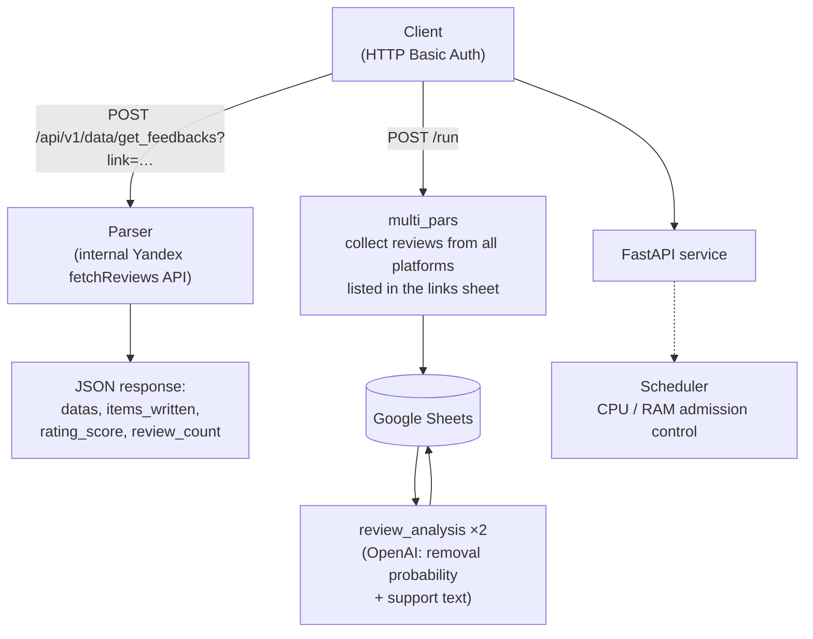

# ai_dispute — AI Contestation Service

> **🌐 [English](README.md) (default) · [Русский](README.ru.md)**

A FastAPI microservice that collects negative customer reviews from major review
platforms, stores them in Google Sheets, and runs an AI-powered analysis that estimates
the probability of getting each review removed and drafts support messages for
platform moderation teams.

Runs on a dedicated **VDS server** (Docker Compose) with automatic deployment:
every push to `main` triggers a GitHub Actions pipeline that builds the Docker image,
pushes it to GHCR and updates the service on the server over SSH.

---

## Table of Contents

- [How It Works](#how-it-works)
- [Supported Platforms](#supported-platforms)
- [API](#api)
  - [Authentication](#authentication)
  - [POST /api/v1/data/get_feedbacks](#post-apiv1dataget_feedbacks)
  - [POST /run](#post-run)
  - [GET /tasks/{task_id}](#get-taskstask_id)
  - [GET /capacity](#get-capacity)
  - [GET /healthz](#get-healthz)
- [Concurrency & Resource Control](#concurrency--resource-control)
- [Task Lifetime](#task-lifetime)
- [Configuration](#configuration)
- [Google Sheets Layout](#google-sheets-layout)
- [Running Locally](#running-locally)
- [Automatic Deployment (VDS)](#automatic-deployment-vds)
- [Project Structure](#project-structure)
- [Tech Stack](#tech-stack)

---

## How It Works



Every request passes through a **resource-aware scheduler**: the first launch of each
endpoint is always accepted, every additional launch is admitted only if the container
has enough free CPU/memory (otherwise — `HTTP 429`). Each background task has a hard
lifetime limit, so a task cannot hang forever.

---

## Supported Platforms

| Platform | URL pattern | Collection method |
|----------|-------------|-------------------|
| Yandex Maps (organization pages) | `yandex.ru/maps/org/…`, `yandex.md/maps/org/…` | Internal `fetchReviews` API via Playwright (sort-switch interception) |
| Yandex Reviews | `reviews.yandex.ru` | Hidden digest REST API (no browser) |
| 2GIS *(planned)* | `2gis.ru` | Public reviews API (curl_cffi) |
| Otzovik | `otzovik.com` | Playwright + 2captcha solver |
| iRecommend | `irecommend.ru` | Playwright + BeautifulSoup |
| Zoon | `zoon.ru` | Playwright |
| Tripadvisor | `tripadvisor.ru` | Playwright |
| Dream Job | `dreamjob.ru` | BeautifulSoup (plain requests) |
| Pravda Sotrudnikov | `pravda-sotrudnikov.ru` | BeautifulSoup (plain requests) |
| Otzyvru | `otzyvru.com` | Playwright + BeautifulSoup |

---

## API

### Authentication

All endpoints except `/healthz` require **HTTP Basic Auth**:

- login: `HOST_USERNAME`
- password: `HOST_PASSWORD`

The same credentials are used for requests to the processing farm.
If neither variable is set (local development), authentication is disabled.

```bash
curl -u 'login:password' ...
```

Returns `401 Unauthorized` on invalid credentials.

---

### POST /api/v1/data/get_feedbacks

Fetches fresh reviews for one page URL and returns them as JSON.
Nothing is written to Google Sheets. Contract-compatible with the `GetBlock` client
used by other projects — point it at this server and it works as-is.

**Query parameters**

| Param | Required | Description |
|-------|----------|-------------|
| `link` | ✅ | URL of the reviews page (e.g. Yandex Maps org page) |
| `topic` | — | Optional topic/section filter (reserved for future parsers) |

**Response** `200 OK`

```json
{
  "datas": {
    "Дата": ["17.08.2026", "..."],
    "Текст": ["...", "..."],
    "Автор": ["Tatiana Tk", "..."],
    "Оценка": [5, 1],
    "Url": ["https://yandex.md/maps/org/…?reviews%5BpublicId%5D=…", "..."],
    "Общий Url": ["https://yandex.md/maps/org/…", "..."],
    "Кол-во отзывов": [695, 695],
    "Оценка компании до удаления": [4.7, 4.7]
  },
  "items_written": 50,
  "rating_score": 4.7,
  "review_count": 695
}
```

**Example (cURL)**

```bash
curl -X POST 'http://localhost:8000/api/v1/data/get_feedbacks?link=https://yandex.md/maps/org/avtomir_mazda/86615003593/reviews/' \
     -u 'login:password'
```

**Example (Python, same contract as other projects)**

```python
import httpx

async def create_task(link: str):
    base_url = "http://<vds-ip>:8000"   # our server
    async with httpx.AsyncClient(base_url=base_url, timeout=httpx.Timeout(300.0, connect=10.0)) as client:
        response = await client.post(
            "/api/v1/data/get_feedbacks",
            headers={"accept": "application/json"},
            params={"link": link},
            auth=("username", "password"),
            timeout=httpx.Timeout(300.0, connect=10.0),
        )
        response.raise_for_status()
        return response.json()
```

**Status codes**: `200` OK · `401` bad credentials · `422` missing `link` ·
`429` no free resources · `501` parser not implemented yet (2GIS) · `504` timeout

---

### POST /run

Starts the full contestation pipeline as a background task:

1. **multi_pars** — collect reviews from every URL listed in the `links` sheet;
2. **review_analysis** — OpenAI estimates removal probability and writes a support text (pass 1);
3. **review_analysis** — second pass picks up rows skipped during the first one.

Results are appended to the Google Sheet specified by `ss_id`.

**Request body**

```json
{
  "ss_id": "1ABCdefGHIjklMNOpqrsTUVwxyz",
  "project": "Evotor"
}
```

| Field | Required | Default | Description |
|-------|----------|---------|-------------|
| `ss_id` | ✅ | — | Google Sheets spreadsheet ID |
| `project` | — | `"default"` | Worksheet (tab) name inside the spreadsheet |

**Response** `202 Accepted`

```json
{"task_id": "3fa85f64-5717-4562-b3fc-2c963f66afa6",
 "status": "pending",
 "ss_id": "1ABC…",
 "project": "Evotor"}
```

**Status codes**: `202` started · `401` bad credentials · `409` a task for this `ss_id`
is already running · `422` validation error · `429` no free resources

---

### GET /tasks/{task_id}

Current state of a background task.

```json
{
  "id": "3fa85f64-…",
  "ss_id": "1ABC…",
  "project": "Evotor",
  "status": "success",
  "stage": "done",
  "created_at": "2026-08-21T09:00:00+00:00",
  "started_at": "2026-08-21T09:00:01+00:00",
  "finished_at": "2026-08-21T11:24:07+00:00",
  "result": {"message": "OK: Evotor"}
}
```

`status`: `pending → running → success | error`
`stage`: `multi_pars → review_analysis (проход 1/2) → done`

---

### GET /capacity

Live report of container resources and how many more launches fit right now.

```json
{
  "cpu_limit": 2.0,
  "mem_limit_gb": 4.0,
  "base_cpu": 0.3,
  "base_mem_gb": 0.5,
  "running": {"run": 1, "get_feedback": 0},
  "load_cpu": 1.3,
  "load_mem_gb": 2.0,
  "free_cpu": 0.7,
  "free_mem_gb": 2.0,
  "capacity_more": {
    "run": {"by_cpu": 0, "by_mem": 1, "min": 0},
    "get_feedback": {"by_cpu": 1, "by_mem": 2, "min": 1}
  }
}
```

---

### GET /healthz

Liveness/readiness probe. Always returns `{"status": "ok"}` — no authentication.

---

## Concurrency & Resource Control

Before **every** launch the service checks whether the container has room for one more job:

- container limits are read from the cgroup (in Kubernetes these are the pod `limits`;
  in Docker Compose — `deploy.resources.limits`);
- each endpoint type has a **guaranteed minimum of 1 concurrent launch** — the first
  launch is always accepted;
- every additional launch is accepted only if
  `base usage + weight of running tasks + weight of the new task ≤ container limits`
  (both CPU and memory are checked);
- if there is not enough room, the endpoint responds `429` with a human-readable reason;
- weights are configurable via environment variables (see
  [Configuration](#configuration)) — e.g. with default weights and a 2 CPU / 4 GB
  container: `1 × run + 1 × get_feedback` fits (2.0 CPU / 3.0 GB), a second `run` does not.

Because the container physically cannot exceed its own limits, these limits are the
correct ceiling for this calculation even when other workloads share the server.

## Task Lifetime

No task can hang forever:

| Endpoint | Timeout variable | Default | On expiry |
|----------|------------------|---------|-----------|
| `/run` | `TASK_TIMEOUT_SEC` | 8 hours | Task is cancelled, Playwright browsers closed, status → `error` |
| `/api/v1/data/get_feedbacks` | `FEEDBACK_TIMEOUT_SEC` | 15 minutes | `504 Gateway Timeout` |

Additionally, all blocking HTTP calls inside parsers have their own timeouts, and if
the process ever hangs completely, Docker restarts the container
(`restart: unless-stopped` in `docker-compose.yml`; the compose healthcheck monitors
`/healthz`).

---

## Configuration

All settings are provided through environment variables — a single `.env` file on the
deployment server (VDS). See `.env.example` for a full template.

| Variable | Default | Description |
|----------|---------|-------------|
| **Auth** | | |
| `HOST_USERNAME` | — | Login for HTTP Basic Auth on all endpoints |
| `HOST_PASSWORD` | — | Password for HTTP Basic Auth on all endpoints |
| **Database (PostgreSQL)** | | |
| `POSTGRESQL_HOST` / `_PORT` / `_DB` / `_USERNAME` / `_PASSWORD` | — | Connection to the database holding GPT tokens (`tokens`), forum rules (`forum_rules`) and the proxy pool (`proxies`) |
| **Parsing** | | |
| `HEADLESS` | auto | Force headless browsers (`true` in containers) |
| `PROXY_ON` | auto | Route browser traffic through the proxy pool from DB |
| `MAX_SEC` | 30 | Max random pause between site requests, seconds |
| `CAPTCHA_KEY` | — | 2captcha API key (used by the Otzovik parser) |
| `SERVICE_ACCOUNT_FILE` | `utils/service_account.json` | Path to the Google service account file |
| **Scheduler** | | |
| `POD_CPU_LIMIT` / `POD_MEM_GB_LIMIT` | from cgroup | Resource ceiling override |
| `TASK_CPU_RUN` / `TASK_MEM_RUN` | 1.0 / 1.5 | Weight of one `/run` launch |
| `TASK_CPU_GET_FEEDBACK` / `TASK_MEM_GET_FEEDBACK` | 0.7 / 1.0 | Weight of one `get_feedbacks` launch |
| `BASE_CPU` / `BASE_MEM_GB` | 0.3 / 0.5 | Baseline consumption of the service itself |
| **Task lifetime** | | |
| `TASK_TIMEOUT_SEC` | 28800 | `/run` hard timeout, seconds |
| `FEEDBACK_TIMEOUT_SEC` | 900 | `get_feedbacks` hard timeout, seconds |

---

## Google Sheets Layout

The Google service account (`service_account.json`) is **not stored in git** — it is a
credential placed on the deployment server (see
[`deploy/README.md`](deploy/README.md)) and must have edit access to the target
spreadsheets.

**`links` worksheet** (input for `/run`) — one row per page to collect:

| link | status | max_raiting | last_page |
|------|--------|-------------|-----------|
| `https://yandex.md/maps/org/…/reviews/` | `OK!` or error text | `5` | `0` |

Rows whose `status` is already `OK!` are skipped; failed rows are retried on the next run.

**`<project>` worksheet** (output) — created automatically:

Collection columns: `Дата`, `Текст`, `Бренд`, `Источник`, `Url`, `Автор`, `Оценка`,
`Общий Url`, `Кол-во отзывов`, `Оценка компании до удаления`.
Analysis columns filled by `review_analysis`: `Вероятность удаления`,
`Текст для поддержки`, `Оценка компании после удаления`.

Forum rules for the AI prompt are read from the `forum_rules` DB table, matched by the
source domain (e.g. `yandex_maps`, `otzovik`).

---

## Running Locally

```bash
python3.12 -m venv venv && source venv/bin/activate
pip install -r requirements.txt
playwright install chromium

cp .env.example .env              # fill in real values
# utils/service_account.json тоже нужно положить рядом с проектом (в git его нет)

uvicorn app:app --host 0.0.0.0 --port 8000
```

The service starts even without a database — the GPT token is loaded lazily on the
first AI call. However, `/run` and the AI analysis require a reachable PostgreSQL,
and the Google service account must have access to your spreadsheets.

Interactive API docs: <http://localhost:8000/docs>

---

## Automatic Deployment (VDS)

The service runs on a dedicated VDS server via **Docker Compose**, and deployment is
fully automated: **a push to `main` triggers GitHub Actions**, which builds the image,
pushes it to GHCR, connects to the server over SSH and runs
`docker compose pull && docker compose up -d`, then verifies `/healthz`.

```
GitHub push → GH Actions (build → GHCR) → SSH → VDS: docker compose up -d
```

Server layout (`/opt/ai-dispute`): `docker-compose.yml` + `.env` (settings and
secrets) + `secrets/service_account.json` (Google credentials).

The complete step-by-step guide — one-time VDS setup, GitHub secrets, troubleshooting —
is in [`deploy/README.md`](deploy/README.md).

Quick check after a deploy:

```bash
curl http://<VDS-IP>:8000/healthz          # {"status":"ok"}
curl http://<VDS-IP>:8000/capacity         # live resource report
```

---

## Project Structure

```
├── app.py                        # FastAPI service: endpoints, auth, scheduler, timeouts
├── ai/
│   └── ai_contestation.py        # Core logic: multi_pars, review_analysis, all parsers
├── portals/                      # Per-platform extraction helpers
│   ├── dreamjob.py               #   dreamjob.ru (BS4)
│   ├── otzovru.py                #   otzyvru.com (Playwright + BS4)
│   ├── portal_2gis.py            #   2gis.ru (URL helpers)
│   ├── portal_otzovik.py         #   otzovik.com (captcha solving, feedback)
│   ├── portal_tripadvisor.py     #   tripadvisor.ru (Playwright)
│   ├── portal_ya.py              #   Yandex helpers (digest response parsing)
│   ├── portal_zoon.py            #   zoon.ru (Playwright)
│   └── pravda_sotrudnikov.py     #   pravda-sotrudnikov.ru (BS4)
├── utils/
│   ├── ai_module.py              # OpenAI client (GPT token loaded from DB)
│   ├── anticaptcha.py            # 2captcha integration (Otzovik captcha)
│   ├── central_module.py         # server IP / headless detection, pauses
│   ├── constants.py              # shared constants
│   ├── db_loader.py              # async SQLAlchemy engine + queries
│   ├── gs_editor.py              # Google Sheets wrapper (read/append/update)
│   ├── proxy_module.py           # proxy pool from DB with liveness checks
│   ├── scheduler.py              # resource-aware admission control
│   ├── user_agent.py             # HTTP clients + Playwright browser factories
│   └── service_account.json      # Google credentials (NOT in git — on server only)
├── models/
│   └── mdl_tables.py             # SQLAlchemy ORM models
├── deploy/
│   ├── deploy.sh                 # Server-side update: pull + up -d + healthz
│   └── README.md                 # Step-by-step VDS deployment guide
├── docker-compose.yml            # VDS deployment: container, env, volume, healthcheck
├── Dockerfile                    # python:3.12-slim + Playwright Chromium
├── requirements.txt
└── .github/workflows/            # CI/CD: build → GHCR → SSH deploy to VDS
```

## Tech Stack

| Layer | Technology |
|-------|------------|
| API | FastAPI, Uvicorn, Pydantic |
| Scraping | Playwright (Chromium), curl_cffi, aiohttp, BeautifulSoup |
| AI | OpenAI Chat Completions API |
| Storage | Google Sheets API (service account), PostgreSQL (SQLAlchemy 2 + asyncpg) |
| Anti-bot | playwright-stealth, playwright-captcha, 2captcha |
| Packaging | Docker (python:3.12-slim), Docker Compose, GitHub Actions |
