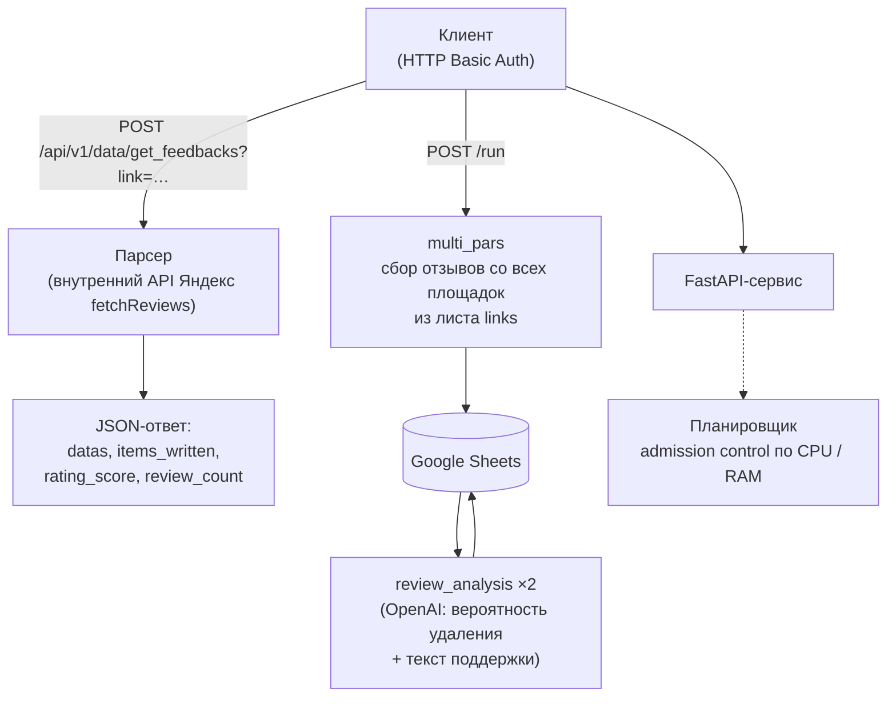

# AI Contestation Service

> **🌐 [English](README.md) · [Русский](README.ru.md) (по умолчанию — English)**

FastAPI-микросервис, который собирает негативные отзывы клиентов с крупных
отзывных площадок, сохраняет их в Google Sheets и запускает ИИ-анализ: оценку
вероятности удаления каждого отзыва и подготовку текста обращения в службу
поддержки площадки от имени компании.

Работает на выделенном **VDS-сервере** (Docker Compose) с автоматическим деплоем:
каждый push в `main` запускает пайплайн GitHub Actions — сборку Docker-образа,
публикацию в GHCR и обновление сервиса на сервере по SSH.

---

## Оглавление

- [Как это работает](#как-это-работает)
- [Поддерживаемые площадки](#поддерживаемые-площадки)
- [API](#api)
  - [Аутентификация](#аутентификация)
  - [POST /api/v1/data/get_feedbacks](#post-apiv1dataget_feedbacks)
  - [POST /run](#post-run)
  - [GET /tasks/{task_id}](#get-taskstask_id)
  - [GET /capacity](#get-capacity)
  - [GET /healthz](#get-healthz)
- [Параллельные запуски и ресурсы](#параллельные-запуски-и-ресурсы)
- [Время жизни задач](#время-жизни-задач)
- [Конфигурация](#конфигурация)
- [Структура Google-таблиц](#структура-google-таблиц)
- [Запуск локально](#запуск-локально)
- [Автоматический деплой (VDS)](#автоматический-деплой-vds)
- [Структура проекта](#структура-проекта)
- [Технологии](#технологии)

---

## Как это работает



Каждый запрос проходит через **планировщик ресурсов**: первый запуск каждой точки
принимается всегда, каждый следующий — только если в контейнере достаточно свободных
CPU/памяти (иначе — `HTTP 429`). У каждой фоновой задачи есть жёсткий лимит времени
жизни — задача не может зависнуть.

---

## Поддерживаемые площадки

| Площадка | URL-паттерн | Метод сбора |
|----------|-------------|-------------|
| Яндекс.Карты (страницы организаций) | `yandex.ru/maps/org/…`, `yandex.md/maps/org/…` | Внутренний API `fetchReviews` через Playwright (перехват при смене сортировки) |
| Яндекс Отзывы | `reviews.yandex.ru` | Скрытый REST API digest (без браузера) |
| 2GIS *(в разработке)* | `2gis.ru` | Public reviews API (curl_cffi) |
| Otzovik | `otzovik.com` | Playwright + решение капчи 2captcha |
| iRecommend | `irecommend.ru` | Playwright + BeautifulSoup |
| Zoon | `zoon.ru` | Playwright |
| Tripadvisor | `tripadvisor.ru` | Playwright |
| Dream Job | `dreamjob.ru` | BeautifulSoup (обычные запросы) |
| Pravda Sotrudnikov | `pravda-sotrudnikov.ru` | BeautifulSoup (обычные запросы) |
| Otzyvru | `otzyvru.com` | Playwright + BeautifulSoup |

---

## API

### Аутентификация

Все точки, кроме `/healthz`, требуют **HTTP Basic Auth**:

- логин: `HOST_USERNAME`
- пароль: `HOST_PASSWORD`

Эти же креды используются для запроса к ферме обработки.
Если переменные не заданы (локальная разработка) — авторизация отключена.

```bash
curl -u 'логин:пароль' ...
```

При неверных кредах — `401 Unauthorized`.

---

### POST /api/v1/data/get_feedbacks

Получает свежие отзывы по адресу страницы и возвращает их в виде JSON.
Ничего не записывает в Google Sheets. Контракт совместим с клиентом `GetBlock`
из других проектов — достаточно указать наш сервер как `base_url`.

**Query-параметры**

| Параметр | Обязательный | Описание |
|----------|--------------|----------|
| `link` | ✅ | Адрес страницы с отзывами (например, org-страница Яндекс.Карт) |
| `topic` | — | Необязательный фильтр темы/раздела (зарезервирован для будущих парсеров) |

**Ответ** `200 OK`

```json
{
  "datas": {
    "Дата": ["17.08.2026", "..."],
    "Текст": ["...", "..."],
    "Автор": ["Tatiana Tk", "..."],
    "Оценка": [5, 1],
    "Url": ["https://yandex.md/maps/org/…?reviews%5BpublicId%5D=…", "..."],
    "Общий Url": ["https://yandex.md/maps/org/…", "..."],
    "Кол-во отзывов": [695, 695],
    "Оценка компании до удаления": [4.7, 4.7]
  },
  "items_written": 50,
  "rating_score": 4.7,
  "review_count": 695
}
```

**Пример (cURL)**

```bash
curl -X POST 'http://localhost:8000/api/v1/data/get_feedbacks?link=https://yandex.md/maps/org/avtomir_mazda/86615003593/reviews/' \
     -u 'логин:пароль'
```

**Пример (Python, тот же контракт, что в других проектах)**

```python
import httpx

async def create_task(link: str):
    base_url = "http://<ip-vds>:8000"   # наш сервер
    async with httpx.AsyncClient(base_url=base_url, timeout=httpx.Timeout(300.0, connect=10.0)) as client:
        response = await client.post(
            "/api/v1/data/get_feedbacks",
            headers={"accept": "application/json"},
            params={"link": link},
            auth=("username", "password"),
            timeout=httpx.Timeout(300.0, connect=10.0),
        )
        response.raise_for_status()
        return response.json()
```

**Коды ответа**: `200` OK · `401` неверные креды · `422` нет `link` ·
`429` нет свободных ресурсов · `501` парсер ещё не реализован (2GIS) · `504` таймаут

---

### POST /run

Запускает полный пайплайн оспаривания как фоновую задачу:

1. **multi_pars** — сбор отзывов по всем ссылкам из листа `links`;
2. **review_analysis** — OpenAI оценивает вероятность удаления и пишет текст поддержки (проход 1);
3. **review_analysis** — второй проход добивает строки, пропущенные первым.

Результаты добавляются в Google-таблицу, указанную в `ss_id`.

**Тело запроса**

```json
{
  "ss_id": "1ABCdefGHIjklMNOpqrsTUVwxyz",
  "project": "Evotor"
}
```

| Поле | Обязательное | По умолчанию | Описание |
|------|--------------|--------------|----------|
| `ss_id` | ✅ | — | ID Google-таблицы |
| `project` | — | `"default"` | Имя вкладки (листа) внутри таблицы |

**Ответ** `202 Accepted`

```json
{"task_id": "3fa85f64-5717-4562-b3fc-2c963f66afa6",
 "status": "pending",
 "ss_id": "1ABC…",
 "project": "Evotor"}
```

**Коды ответа**: `202` запущено · `401` неверные креды · `409` задача для этого
`ss_id` уже выполняется · `422` ошибка валидации · `429` нет свободных ресурсов

---

### GET /tasks/{task_id}

Текущее состояние фоновой задачи.

```json
{
  "id": "3fa85f64-…",
  "ss_id": "1ABC…",
  "project": "Evotor",
  "status": "success",
  "stage": "done",
  "created_at": "2026-08-21T09:00:00+00:00",
  "started_at": "2026-08-21T09:00:01+00:00",
  "finished_at": "2026-08-21T11:24:07+00:00",
  "result": {"message": "OK: Evotor"}
}
```

`status`: `pending → running → success | error`
`stage`: `multi_pars → review_analysis (проход 1/2) → done`

---

### GET /capacity

Живой отчёт по ресурсам контейнера и тому, сколько ещё запусков влезет прямо сейчас.

```json
{
  "cpu_limit": 2.0,
  "mem_limit_gb": 4.0,
  "base_cpu": 0.3,
  "base_mem_gb": 0.5,
  "running": {"run": 1, "get_feedback": 0},
  "load_cpu": 1.3,
  "load_mem_gb": 2.0,
  "free_cpu": 0.7,
  "free_mem_gb": 2.0,
  "capacity_more": {
    "run": {"by_cpu": 0, "by_mem": 1, "min": 0},
    "get_feedback": {"by_cpu": 1, "by_mem": 2, "min": 1}
  }
}
```

---

### GET /healthz

Проба liveness/readiness. Всегда возвращает `{"status": "ok"}` — без авторизации.

---

## Параллельные запуски и ресурсы

Перед **каждым** запуском сервис проверяет, есть ли в контейнере место ещё под одну задачу:

- лимиты читаются из cgroup контейнера (в Kubernetes это pod `limits`;
  в Docker Compose — `deploy.resources.limits`);
- у каждого типа точки есть **гарантированный минимум 1 одновременный запуск** —
  первый запуск принимается всегда;
- каждый следующий запуск принимается, только если
  `базовое потребление + вес запущенных задач + вес новой задачи ≤ лимиты контейнера`
  (проверяются и CPU, и память);
- если места нет — точка отвечает `429` с понятным текстом причины;
- веса настраиваются переменными окружения (см. [Конфигурацию](#конфигурация)) —
  например, при весах по умолчанию и лимитах 2 CPU / 4 ГБ:
  `1 × run + 1 × get_feedback` влезает (2.0 CPU / 3.0 ГБ), второй `run` — уже нет.

Контейнер физически не может выйти за свои лимиты, поэтому именно они — корректный
потолок для расчёта, даже когда на сервере работают другие нагрузки.

## Время жизни задач

Задача не может зависнуть:

| Точка | Переменная таймаута | По умолчанию | При превышении |
|-------|---------------------|--------------|----------------|
| `/run` | `TASK_TIMEOUT_SEC` | 8 часов | Задача отменяется, браузеры Playwright закрываются, статус → `error` |
| `/api/v1/data/get_feedbacks` | `FEEDBACK_TIMEOUT_SEC` | 15 минут | `504 Gateway Timeout` |

Дополнительно у всех блокирующих HTTP-вызовов внутри парсеров есть собственные
таймауты, а если процесс зависнет целиком — Docker перезапустит контейнер
(`restart: unless-stopped` в `docker-compose.yml`; healthcheck компоуза следит
за `/healthz`).

---

## Конфигурация

Все настройки задаются переменными окружения — единым файлом `.env` на сервере (VDS).
Полный шаблон — в `.env.example`.

| Переменная | По умолчанию | Описание |
|------------|--------------|----------|
| **Авторизация** | | |
| `HOST_USERNAME` | — | Логин HTTP Basic Auth для всех точек |
| `HOST_PASSWORD` | — | Пароль HTTP Basic Auth для всех точек |
| **База данных (PostgreSQL)** | | |
| `POSTGRESQL_HOST` / `_PORT` / `_DB` / `_USERNAME` / `_PASSWORD` | — | Подключение к БД: токены GPT (`tokens`), правила форумов (`forum_rules`), пул прокси (`proxies`) |
| **Парсинг** | | |
| `HEADLESS` | авто | Принудительно headless-браузеры (`true` в контейнерах) |
| `PROXY_ON` | авто | Гнать трафик браузеров через пул прокси из БД |
| `MAX_SEC` | 30 | Максимальная случайная пауза между запросами к сайтам, сек |
| `CAPTCHA_KEY` | — | Ключ 2captcha (нужен парсеру Otzovik) |
| `SERVICE_ACCOUNT_FILE` | `utils/service_account.json` | Путь к файлу Google service account |
| **Планировщик** | | |
| `POD_CPU_LIMIT` / `POD_MEM_GB_LIMIT` | из cgroup | Переопределение потолка ресурсов |
| `TASK_CPU_RUN` / `TASK_MEM_RUN` | 1.0 / 1.5 | Вес одного запуска `/run` |
| `TASK_CPU_GET_FEEDBACK` / `TASK_MEM_GET_FEEDBACK` | 0.7 / 1.0 | Вес одного запуска `get_feedbacks` |
| `BASE_CPU` / `BASE_MEM_GB` | 0.3 / 0.5 | Базовое потребление самого сервиса |
| **Время жизни задач** | | |
| `TASK_TIMEOUT_SEC` | 28800 | Жёсткий таймаут `/run`, сек |
| `FEEDBACK_TIMEOUT_SEC` | 900 | Жёсткий таймаут `get_feedbacks`, сек |

---

## Структура Google-таблиц

Google service account (`service_account.json`) **не хранится в git** — это секрет,
который кладётся на сервер развертывания (см.
[`deploy/README.md`](deploy/README.md)); у аккаунта должен быть доступ на
редактирование целевых таблиц.

**Лист `links`** (вход для `/run`) — по одной строке на страницу сбора:

| link | status | max_raiting | last_page |
|------|--------|-------------|-----------|
| `https://yandex.md/maps/org/…/reviews/` | `OK!` или текст ошибки | `5` | `0` |

Строки со статусом `OK!` пропускаются; упавшие строки обрабатываются при следующем запуске.

**Лист `<project>`** (выход) — создаётся автоматически:

Колонки сбора: `Дата`, `Текст`, `Бренд`, `Источник`, `Url`, `Автор`, `Оценка`,
`Общий Url`, `Кол-во отзывов`, `Оценка компании до удаления`.
Колонки анализа (заполняет `review_analysis`): `Вероятность удаления`,
`Текст для поддержки`, `Оценка компании после удаления`.

Правила форумов для ИИ-промпта читаются из таблицы `forum_rules` в БД и
подбираются по домену источника (например, `yandex_maps`, `otzovik`).

---

## Запуск локально

```bash
python3.12 -m venv venv && source venv/bin/activate
pip install -r requirements.txt
playwright install chromium

cp .env.example .env              # заполнить реальными значениями
# рядом с проектом также нужен utils/service_account.json (в git его нет)

uvicorn app:app --host 0.0.0.0 --port 8000
```

Сервис стартует даже без базы данных — токен GPT подгружается лениво при первом
ИИ-вызове. Однако `/run` и ИИ-анализ требуют доступного PostgreSQL, а Google
service account должен иметь доступ к вашим таблицам.

Интерактивная документация API: <http://localhost:8000/docs>

---

## Автоматический деплой (VDS)

Сервис работает на выделенном VDS через **Docker Compose**, деплой полностью
автоматический: **push в `main` запускает GitHub Actions** — сборка образа,
публикация в GHCR, подключение к серверу по SSH и
`docker compose pull && docker compose up -d`, затем проверка `/healthz`.

```
GitHub push → GH Actions (build → GHCR) → SSH → VDS: docker compose up -d
```

Структура на сервере (`/opt/ai-contestation`): `docker-compose.yml` + `.env`
(настройки и секреты) + `secrets/service_account.json` (Google-креды).

Пошаговое руководство — одноразовая настройка VDS, секреты GitHub, поиск проблем —
в [`deploy/README.md`](deploy/README.md).

Быстрая проверка после деплоя:

```bash
curl http://<IP-VDS>:8000/healthz          # {"status":"ok"}
curl http://<IP-VDS>:8000/capacity         # живой отчёт по ресурсам
```

---

## Структура проекта

```
├── app.py                        # FastAPI-сервис: точки, авторизация, планировщик, таймауты
├── ai/
│   └── ai_contestation.py        # Ядро: multi_pars, review_analysis, все парсеры
├── portals/                      # Хелперы сбора по площадкам
│   ├── dreamjob.py               #   dreamjob.ru (BS4)
│   ├── otzovru.py                #   otzyvru.com (Playwright + BS4)
│   ├── portal_2gis.py            #   2gis.ru (URL-хелперы)
│   ├── portal_otzovik.py         #   otzovik.com (капча, текст отзыва)
│   ├── portal_tripadvisor.py     #   tripadvisor.ru (Playwright)
│   ├── portal_ya.py              #   Хелперы Яндекса (разбор digest)
│   ├── portal_zoon.py            #   zoon.ru (Playwright)
│   └── pravda_sotrudnikov.py     #   pravda-sotrudnikov.ru (BS4)
├── utils/
│   ├── ai_module.py              # OpenAI-клиент (токен GPT из БД)
│   ├── anticaptcha.py            # Интеграция 2captcha (капча Otzovik)
│   ├── central_module.py         # Определение IP/headless, паузы
│   ├── constants.py              # Общие константы
│   ├── db_loader.py              # Async SQLAlchemy engine + запросы
│   ├── gs_editor.py              # Обёртка Google Sheets (чтение/запись)
│   ├── proxy_module.py           # Пул прокси из БД с проверкой живости
│   ├── scheduler.py              # Admission control по ресурсам
│   ├── user_agent.py             # HTTP-клиенты + фабрики Playwright
│   └── service_account.json      # Google-креды (НЕ в git — только на сервере)
├── models/
│   └── mdl_tables.py             # SQLAlchemy ORM-модели
├── deploy/
│   ├── deploy.sh                 # Обновление на сервере: pull + up -d + healthz
│   └── README.md                 # Пошаговый гайд деплоя на VDS
├── docker-compose.yml            # Деплой на VDS: контейнер, env, volume, healthcheck
├── Dockerfile                    # python:3.12-slim + Playwright Chromium
├── requirements.txt
└── .github/workflows/            # CI/CD: build → GHCR → SSH-деплой на VDS
```

## Технологии

| Слой | Технологии |
|------|------------|
| API | FastAPI, Uvicorn, Pydantic |
| Сбор данных | Playwright (Chromium), curl_cffi, aiohttp, BeautifulSoup |
| ИИ | OpenAI Chat Completions API |
| Хранилища | Google Sheets API (service account), PostgreSQL (SQLAlchemy 2 + asyncpg) |
| Анти-бот | playwright-stealth, playwright-captcha, 2captcha |
| Упаковка | Docker (python:3.12-slim), Docker Compose, GitHub Actions |
